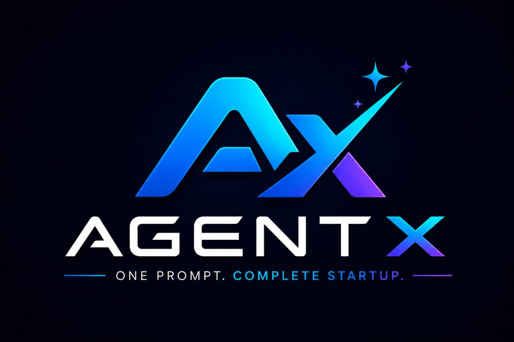

# 🚀 AgentX Startup Builder

<p align="center">
  
</p>

<h3 align="center">
One Prompt. Complete Startup.
</h3>

<p align="center">
AI-powered Multi-Agent Startup Generator that transforms an idea into a complete business in minutes.
</p>

---

## 🌟 Overview

AgentX Startup Builder is an AI-powered multi-agent platform built for entrepreneurs, students, and innovators.

Instead of manually researching, planning, branding, and marketing a startup, users simply enter **one startup idea**.

Our AI agents collaborate to generate an entire startup package including:

- 📊 Market Research
- 🎨 Branding
- 💼 Business Plan
- 💰 Financial Forecast
- 📢 Marketing Strategy
- 📱 Social Media Campaign
- 🌐 Website Content
- 🎤 Investor Pitch Deck
- 🧠 AI Startup Assistant

---

# ✨ Features

## 🤖 Multi-Agent AI System

Each AI agent specializes in one business domain.

- 🔍 Market Research Agent
- 🎨 Branding Agent
- 💼 Business Planning Agent
- 💵 Financial Agent
- 📈 Marketing Agent
- 📱 Social Media Agent
- 🌐 Website Generator Agent
- 🛡 Risk Analysis Agent
- 🧠 Startup Advisor Agent
- 💬 AI Startup Chatbot

---

## 🧠 AI Startup Chatbot

Supports:

- Startup Q&A
- Business Advice
- 10+ Languages
- Startup Context Memory
- Voice Commands
- Floating Assistant

---

## 🧪 Self-Correcting AI Code Generator

Our autonomous coding agent can:

- Generate Code
- Execute inside Docker Sandbox
- Parse Runtime Errors
- Retry Automatically
- Fix Bugs
- Improve Code Quality

---

## 🎙 Voice Command Navigation

Navigate the website using voice.

Examples:

- "Open Dashboard"
- "Generate Branding"
- "Go to Financial Plan"
- "Create Business Plan"

---

## 📈 AI Generated Reports

Generate:

- SWOT Analysis
- Competitor Analysis
- Revenue Prediction
- Market Size
- Customer Personas
- Pricing Strategy
- Launch Roadmap

---

## 📄 Export Options

- PDF Reports
- Startup Summary
- Business Plan
- Branding Guide
- Financial Reports

---

# 🏗 Architecture

```
                User
                  │
                  ▼
          Startup Idea Input
                  │
                  ▼
        Multi-Agent Orchestrator
                  │
────────────────────────────────────────────
│         │         │         │            │
▼         ▼         ▼         ▼            ▼

Market   Branding Business Finance Marketing

▼         ▼         ▼         ▼            ▼

Research Logo     Plan     Forecast Campaign

────────────────────────────────────────────

                  │
                  ▼

      AI Startup Knowledge Base

                  │
                  ▼

        Final Startup Report
```

---

# 🖥 Tech Stack

### Frontend

- HTML5
- CSS3
- JavaScript

### Backend

- Node.js
- Express.js

### AI

- OpenRouter API
- Multi-Agent Architecture
- Prompt Engineering

### Database

- Firebase Authentication
- Firestore Database

### Deployment

- Netlify
- GitHub

### Tools

- Docker
- Git
- GitHub
- VS Code

---

# 📂 Project Structure

```
AgentX-Startup-Builder/

│
├── frontend/
│
├── backend/
│
├── agents/
│   ├── brandingAgent.js
│   ├── marketResearch.js
│   ├── financeAgent.js
│   ├── marketingAgent.js
│   ├── websiteAgent.js
│   ├── chatbotAgent.js
│   └── orchestrator.js
│
├── public/
│
├── assets/
│
├── firebase/
│
├── docs/
│
├── package.json
│
└── README.md
```

---

# 🚀 Installation

## Clone Repository

```bash
git clone https://github.com/aaryak537/AgentX-Startup-Builder.git
```

---

## Enter Project

```bash
cd AgentX-Startup-Builder
```

---

## Install Dependencies

```bash
npm install
```

---

## Create Environment Variables

Create a `.env` file.

```env
OPENROUTER_API_KEY=your_key

FIREBASE_API_KEY=your_key

FIREBASE_AUTH_DOMAIN=your_domain

FIREBASE_PROJECT_ID=your_project

FIREBASE_STORAGE_BUCKET=your_bucket

FIREBASE_MESSAGING_SENDER_ID=your_sender

FIREBASE_APP_ID=your_app
```

---

## Run Project

```bash
npm start
```

or

```bash
node backend/server.js
```

---

# 📸 Screenshots

- Landing Page
- Dashboard
- Startup Overview
- Branding Page
- Financial Dashboard
- AI Chatbot
- Voice Navigation

*(Add screenshots here)*

---

# 🎯 Hackathon Innovation

## Problem

Starting a business requires expertise in:

- Finance
- Marketing
- Branding
- Research
- Strategy

Most beginners don't know where to start.

---

## Solution

AgentX automates the entire startup creation process using autonomous AI agents.

Users simply enter:

> "I want to start a bakery."

Within minutes AgentX generates:

- Business Name
- Logo
- Branding
- Business Plan
- Financial Forecast
- Marketing Strategy
- Website Content
- Social Posts
- Investor Pitch

---

# 🔥 Unique Features

✅ Multi-Agent AI Architecture

✅ Autonomous Planning

✅ Self-Debugging Code Agent

✅ Docker Sandbox Testing

✅ AI Startup Chatbot

✅ Voice Navigation

✅ Live AI Progress

✅ Business Report Generation

✅ Startup Scoring

---

# 📊 Future Roadmap

### Short-Term

- AI Pitch Deck Generator
- Investor Matching
- Team Builder
- Startup Analytics
- Business Model Canvas

### Long-Term

- AI Startup Marketplace
- Funding Recommendations
- Patent Assistant
- Legal Documentation
- Global Startup Community
- Mobile App
- AI Business Coach

---

# 👥 Team AgentX

### Team Name

**AgentX**

### Members

- Aarya Kadam
- Anushka Khengare

---

# 🏆 Built For

Next-Gen AI Hackathon 2026

Domain:
**Agentic AI**

---

# 🤝 Contributing

Contributions are welcome!

1. Fork the project
2. Create your feature branch

```bash
git checkout -b feature-name
```

3. Commit changes

```bash
git commit -m "Added new feature"
```

4. Push

```bash
git push origin feature-name
```

5. Open Pull Request

---

# 📜 License

This project is licensed under the MIT License.

---

# 💙 Acknowledgements

- OpenRouter
- Firebase
- Node.js
- Express.js
- GitHub
- Netlify

---

<p align="center">

⭐ If you like this project, give it a star!

Made with ❤️ by Team AgentX

</p>
